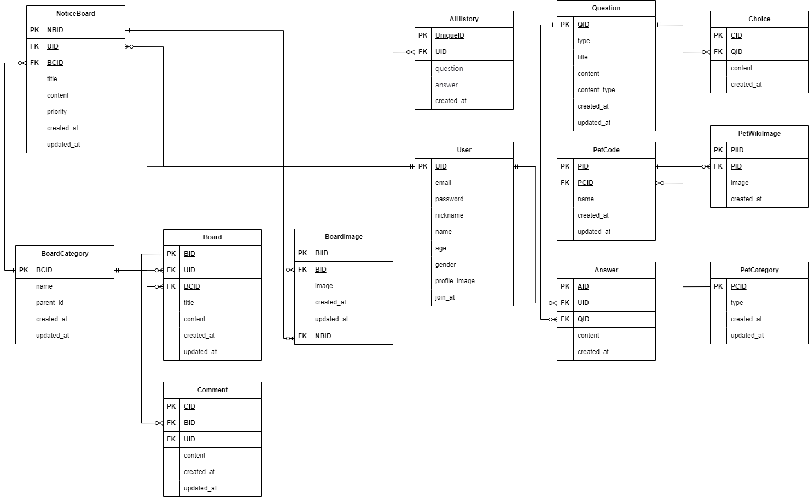

# SA 문서
## 프로젝트 기획서
  - 팀 소개: Living Ease는 편안한 생활을 위한 다양한 솔루션을 제공하는 팀입니다. 우리는 반려동물과 함께하는 삶이 더욱 풍요롭고 행복해질 수 있도록 돕고자 합니다. 현대 사회에서 반려동물은 가족의 일원으로 자리 잡고 있으며, 각자의 라이프스타일과 성격에 맞는 반려동물을 선택하는 것은 매우 중요합니다. 이를 위해, Living Ease는 성숙한 반려동물 문화를 조성하기 위해 최적의 반려동물을 매칭할 수 있는 솔루션을 개발하고 있습니다. 우리의 목표는 사람과 반려동물이 함께 조화롭게 살아갈 수 있는 환경을 조성하는 것입니다.
  
   

  - 프로젝트 개요: 우리 프로젝트는 예비 견주와 초보 견주를 위한 맞춤형 서비스를 제공합니다. 반려견을 처음 맞이하는 분들이나 준비 중인 분들이 반려견과의 생활을 보다 즐겁고 원활하게 시작할 수 있도록 돕고자 합니다. 각 개인의 필요와 상황에 맞춘 정보를 제공받아, 반려견 매칭 서비스, 반려견의 건강 관리 및 병원추천 서비스, 커뮤니티를 통한 견주 산책메이트 탐색 등 다양한 지원을 통해 행복한 반려 생활을 지원합니다.

   

## 개발 기간, 일정(주 단위)
   24.09.25 ~ 24.10.23

   

## 핵심 기능
  AI를 통한 반려동물 매칭
  추천 받은 반려동물에 대한 입양소 정보 제공
  커뮤니티 기능을 통하여 유저간 정보 공유

## 기능 상세
  - 유저
    - 로그인
    - 로그아웃
    - 프로필 조회
    - 프로필 수정
    - 회원 가입
    - 회원 탈퇴

  - 반려동물
    - 질문 리스트 조회
    - 유저 맞춤형 반려동물(반려견) 추천 서비스(LLM 기반)
    - 입양 경로 추천 서비스(유기견 보호 센터, 공공데이터 활용)

  - 커뮤니티
    - 커뮤니티글 등록
    - 커뮤니티글 수정
    - 커뮤니티글 삭제
    - 커뮤니티글 목록 조회
    - 커뮤니티글 상세 조회
  
  - 고객센터
    - 문의 사항 등록
    - 문의 사항 수정
    - 문의 사항 삭제
    - 문의 사항 목록 조회
    - 문의 사항 상세 조회

  - 공지사항
    - 공지사항 전체 목록 조회
    - 공지사항 상세 조회
    - 공지사항 우선 순위

  - 댓글
    - 커뮤니티 댓글 등록
    - 커뮤니티 댓글 수정
    - 커뮤니티 댓글 삭제

  - 검색
   - 아이디 검색
   - 제목 검색
   - 내용 검색

  - 챗봇
    - 사이트 안내 챗봇
    - 반려동물 추천 챗봇

  - 위치서비스(예정)
    - 동물병원 추천 서비스
    - 산책로 추천 서비스

  - 견종 백과(예정)
   - 상세 조회
   - 전체 목록 조회
   - 찜하기

  - 애견 수첩(예정)
   - 반려견 정보 등록
   - 반려견 정보 수정
   - 반려견 정보 삭제
   - 반려견 정보 조회

   

## 역할 분담
  - 유저 : 정순겸(09.25 ~ 09.27)
   - 유저 로그인 username -> email 수정(10.03~10.07)
  - 게시판 : 정순겸(09.30~10.03)
  - 반려동물 : 서영환(09.25)
    - 반려동물 정보 업데이트: 09.30~10.04
    - 질문 내역 리스트 등록: 09.26
    - 공공데이터 연동:09.30
  - 사이트 안내 챗봇 : 정순겸(10.12 ~ 10.15)
  - 반려동물 추천 챗봇 : 서영환(10.18)
  - 사이트 전체적인 디자인 & 퍼블리싱: 김민주(09.25~ )
  - 사이트 프론트앤드(https://github.com/DoosamGwak/living_ease_front): 이승주(09.25 ~)

   

## 개발 환경
    Python 3.10, Django 4.2, React 18.3.1

   

## 와이어프레임
  - https://www.figma.com/design/MvimuTCaSI8T7lwm6HIwnh/Mobile-Apps-%E2%80%93-Prototyping-Kit-(Community)?node-id=1202-5914&node-type=frame&t=G9RxJyMQiWuYX3ps-0

   

## ERD

  - https://drive.google.com/file/d/1Szog6Wzq7f-LkayrjAXwhTsRMK6ynktA/view?usp=sharing
  

## API Reference
## API 엔드포인트 정보

| **카테고리**          | **엔드포인트**                      | **메서드** | **설명**                          |
|-----------------------|-------------------------------------|------------|-----------------------------------|
| **유저**              | `/api/v1/accounts/login/`               | POST       | 로그인                           |
|                       | `/api/v1/accounts/logout/`              | POST       | 로그아웃                         |
|                       | `/api/v1/accounts/<int:pk>/`             | GET        | 프로필 조회                      |
|                       | `/api/v1/accounts/<int:pk>/`             | PUT        | 프로필 수정                      |
|                       | `/api/v1/accounts/signup/`            | POST       | 회원 가입                        |
|                       | `/api/v1/accounts/delete/`              | PUT     | 회원 탈퇴                        |
|                       | `/api/v1/accounts/refresh/`              | POST     | 토큰 재발급                        |
|                       | `/api/v1/accounts/password/`              | POST     | 비밀번호 변경                        |
| **반려동물**          | `/api/v1/pets/questions/`            | GET        | 질문 리스트 조회                 |
|                       | `/api/v1/pets/recommands/`      | GET        | 유저 맞춤형 반려견 추천 조회   |
|                       | `/api/v1/pets/recommands/`      | POST        | 유저 맞춤형 반려견 추천   |
|                       | `/api/v1/pets/metching-center/`       | GET        | 입양 경로 추천            |
| **커뮤니티**          | `/api/v1/boards/community/etc/`           | GET       | 자유글 목록 조회                 |
|                       | `/api/v1/boards/community/etc/`      | POST        | 자유글 등록                  |
|                       | `/api/v1/boards/community/walkingmate/`      | GET     | 워킹메이트 목록 조회                  |
|                       | `/api/v1/boards/community/walkingmate/`           | POST        | 워킹메이트 등록             |
|                       | `/api/v1/boards/community/tip/`      | GET     | 꿀팁 목록 조회                  |
|                       | `/api/v1/boards/community/tip/`           | POST        | 꿀팁 등록             |
| **정보게시판**          | `api/v1/boards/info/vaccine/`           | GET       | 예방접종 목록 조회                 |
|                       | `api/v1/boards/info/vaccine/`      | POST        | 예방접종 등록                  |
|                       | `api/v1/boards/info/training/`      | GET     | 훈련법 목록 조회                  |
|                       | `api/v1/boards/info/training/`           | POST        | 훈련법 등록             |
|                       | `api/v1/boards/info/supplies/`      | GET     | 용품 목록 조회                  |
|                       | `api/v1/boards/info/supplies/`           | POST        | 용품 등록             |
|                       | `api/v1/boards/info/healthyfood/`      | GET     | 식단 목록 조회                  |
|                       | `api/v1/boards/info/healthyfood/`           | POST        | 식단 등록             |
| **고객지원**          | `/api/v1/boards/customer_service/faq/`         | GET       | 공통FAQ 조회                   |
|                       | `/api/v1/boards/customer_service/faq/`    | POST        | 공통FAQ 등록                  |
|                       | `/api/v1/boards/customer_service/howtouse/`    | GET     | 홈페이지 이용방법 조회                   |
|                       | `/api/v1/boards/customer_service/howtouse/`         | POST        | 홈페이지 이용방법 등록              |
|                       | `/api/v1/boards/customer_service/directmsg/`    | GET        | 1:1문의 조회              |
|                       | `/api/v1/boards/customer_service/directmsg/`    | POST        | 1:1문의 등록              |
| **게시판공통**          | `/api/v1/boards/{int:board_pk}/`    | GET        | 게시판 상세조회              |
|                       | `/api/v1/boards/{int:board_pk}/`    | PUT        | 게시판 수정              |
| **공지사항**          | `/api/v1/boards/notice/{int:noticeboard_pk}/`                   | PUT        | 공지사항 수정          |
|                       | `/api/v1/boards/customer_service/notice/`              | GET        | 공지사항 목록 조회               |
|                       | `/api/v1/boards/customer_service/notice/`          | POST        | 공지사항 등록               |
|                       | `/api/v1/boards/notice/{int:noticeboard_pk}/`          | GET        | 공지사항 상세조회               |
|                       | `/api/v1/boards/notice/{int:noticeboard_pk}/`          | DELETE        | 공지사항 삭제               |
| **댓글**              | `/api/v1/boards/{int:board_pk}/comments/`                  | POST       | 댓글 등록               |
|                       | `/api/v1/boards/{int:board_pk}/comments/{int:comment_pk}/`             | PUT        | 댓글 수정               |
|                       | `/api/v1/boards/{int:board_pk}/comments/{int:comment_pk}/`             | DELETE     | 댓글 삭제               |
|                       | `/api/v1/boards/{int:board_pk}/comments/`             | GET     | 댓글 조회               |
| **챗봇**              | `/api/v1/chatbot/`                  | POST       | 사이트안내 및 반려동물(반려견) 추천 봇               |
